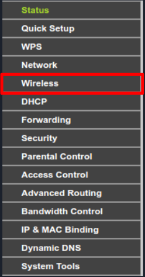
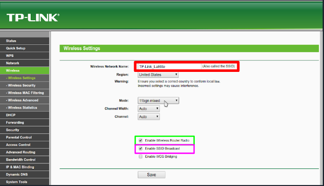
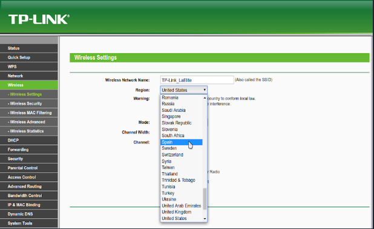
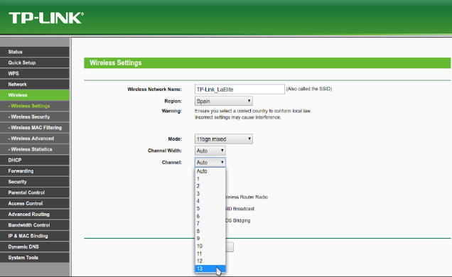
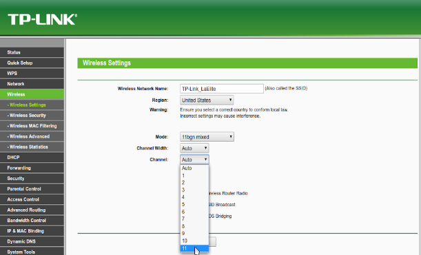
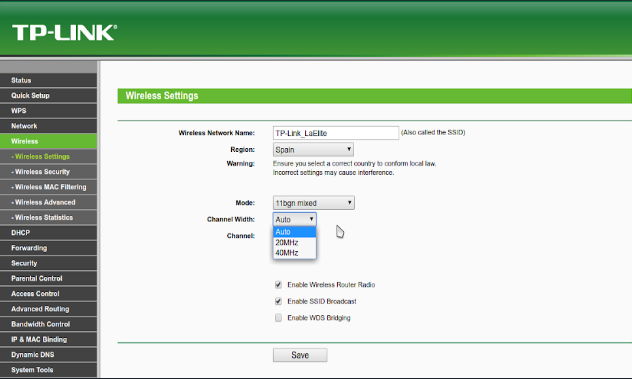
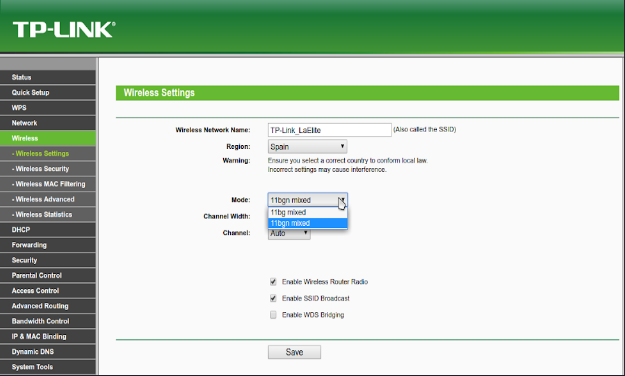

# Configuracion de un Punto de Acceso

## 1. Entrar en nuestro Punto de Acceso y Logearnos

Para poder saber donde tenemos que entrar ahce falta mirar debajo de nuestro punto de acceso
y ver donde pone **Ip adress** que es lo que tendremos que poner en nuestro buscador.
Luego tendremos que poner el username y la contraseña que tambien encontraremos debajo.
(Tendremos que estar en todo momento conectado al router ya sea por cable o por wi-fi)

!imagen

## 2. Entramos en los ajustes de Wi-Fi

Para poder configurar el nombre del wi-fi o las opciones avanzadas nos tenemos que meter 
en la pestaña de wireless.

## 3. Opciones Básicas

La **SSID** es el nombre que veremos en los dispositivos para conectarnos,
también existe la BSSID que sería la MAC que tiene el punto de acceso.
(Yo le he puesto la SSID TP-Link_LaElite)

Es lo que pondremos para activar el wireless y que haya conexion a internet
atraves del wi-fi, sino solo podriamos conectarnos por cable.

Sirve para que se pueda ver el nombre (SSID) en los dispositivos sino 
solo podriamos conectarnos buscando en el dispositivo con la Mac (BSSID)

## 4. Cambiar region

Aquí es donde diremos en qué país nos encontramos, ponemos **Spain** ya que
es donde nos encontramos actualmente.

## 5. Canales

En España hay como máximo 13 canales como en la mayoria de paises. Estos canales
sirven para poder tener menos interferencias con otros puntos de acceso, lo vamos 
a poner en **Auto** ya que lo colocora en el canal con menos interferencias.

En United States hay como máximo **11** canales a diferencia de otros paises.

Tambien existen 14 canales en Japon.

## 6. Banda Ancha

Aquí elegiremos si ponerlo en 1 canal (20MHz) que es mejor si hay muchos
puntos de acceso cerca para no tener tantas interferencias, en 2 (40 MHz) que es
para cuando no hay muchos cerca y que vaya mas rapido o en **automático (Auto)** 
que elegira el mas adecuado para donde nos encontremos.

## 7. Estandares

Yo he puesto estos estandares porque son los mas adecuados para mi **11 bgn mixed**.
Si quereis ver porque he elgido estos lo puedes ver [aqui](https://villalba189.github.io/Estandares/)

